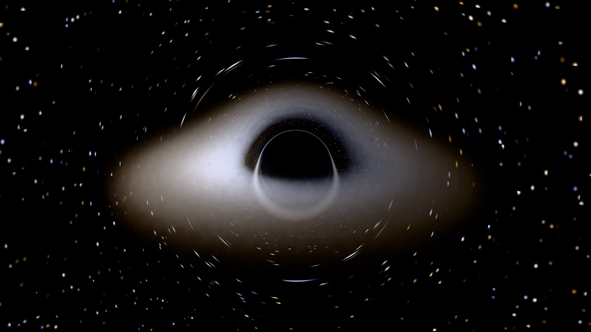

# gargantua

GPU particle accretion disk around a Schwarzschild black hole, rendered
through real gravitational lensing. A native macOS program for Apple
silicon. It opens a window, draws a black hole, and quits when you quit.



It is a visualization with a physics spine, not a research instrument.
Particles orbit and spiral inward under a pseudo Newtonian potential that
reproduces the innermost stable circular orbit; camera rays are integrated
as null geodesics of the Schwarzschild metric, so the lensing, the shadow
and the photon ring are computed rather than painted. Every physical claim
the renderer makes is checked against a double precision CPU oracle by a
test you can run. The line between computed and stylized is drawn below and
never crossed silently.

## What this program can and cannot do to your machine

It can use CPU and GPU cycles, spin fans, warm the chassis, drain a battery
faster, and allocate memory inside a checked budget. That is the complete
list. It runs as an ordinary user process: no administrator rights, no
kernel extensions, no private frameworks, no system settings, no background
agents, no network. The worst realistic failure is a compute kernel that
trips the macOS GPU watchdog, after which the window freezes or the process
dies and the desktop survives.

How that is kept true, in code:

1. Every loop in every shader has a hard iteration cap, named in
   `Sources/Gargantua/Shaders/Constants.h` and checked by a style test.
2. No single command buffer carries more than about 30 ms of GPU work.
   Stills are tiled 128 pixels square, one tile per command buffer, and a
   rebake is spread across four frames.
3. Every command buffer's completion status is checked. On error the
   program prints one sentence and exits with code 2; nothing is resubmitted.
4. Memory is budgeted before it is allocated: at most 40 percent of the
   device's recommended working set, or 3 GB, whichever is smaller. A
   configuration over budget is refused with one sentence naming the number.
5. Rendering is capped at vsync, 60 Hz by default, 30 by flag.
6. Nothing is written to disk except files you ask for: screenshots, still
   renders and benchmark reports, each to a printed path.
7. First run defaults are modest; the largest preset needs an explicit flag
   and prints a sentence about sustained load first.

## Requirements

| Requirement      | Value                                                   |
| ---------------- | ------------------------------------------------------- |
| Hardware         | Apple silicon Mac, M1 or newer, 8 GB or more            |
| OS               | macOS 14 or newer                                       |
| Build            | Swift 6.0 or newer via Swift Package Manager            |
| Frameworks       | Metal, MetalKit, MetalFX, AppKit, all from Apple        |
| Third party code | none                                                    |

Swift 6.0 is the floor because the tests use Swift Testing, which is what
ships with the Command Line Tools; XCTest does not. Shaders live as `.metal`
source in the repository and are embedded into the binary at build time,
then compiled once per launch by the runtime Metal compiler and kept in
memory. Full Xcode is never needed to build or run.

## Build and run

```bash
swift build -c release
```

```bash
.build/release/gargantua
```

The binary is self contained. `make app` wraps it in a minimal
`Gargantua.app` for the Dock.

```
gargantua                          interactive window, default preset
gargantua --preset small|default|max
gargantua --particles N --volume 96|128|192|256 --seed S
gargantua --strategy march|bake
gargantua --fps-cap 30|60
gargantua --no-upscale             present the march resolution directly
gargantua --still out.png --width 3840 --height 2160
gargantua bench                    time both strategies, write bench/results/<date>.json
gargantua validate                 run the goldens on this machine's GPU
gargantua version
```

Errors are one plain sentence on stderr and a nonzero exit: 2 for an
operational failure, 64 for a usage mistake, 1 from `validate` when a
golden fails.

### Controls

| Input        | Action                                          |
| ------------ | ----------------------------------------------- |
| drag         | orbit camera                                    |
| scroll       | dolly                                           |
| 1 / 2 / 3    | preset small / default / max (max needs `--preset max` at launch) |
| space        | pause and resume the simulation                 |
| R            | reseed and restart the disk                     |
| S            | screenshot to ~/Pictures/gargantua/, path printed |
| H            | toggle hud                                      |
| D            | debug view: conserved quantity drift as a heat map, shaded by step count |
| Esc or Cmd-Q | quit                                            |

### Presets

| Preset  | Particles | Volume | March resolution | Gate |
| ------- | --------- | ------ | ---------------- | ---- |
| small   | 250k      | 96^3   | 640 by 360       | none |
| default | 1M        | 128^3  | 960 by 540       | none |
| max     | 4M        | 256^3  | 960 by 540       | `--preset max`, prints a thermal note |

## How a frame is made

Four passes, one command buffer, every vsync:

1. **sim**: one compute dispatch over every particle. Semi implicit Euler in
   the Paczynski and Wiita potential with a velocity space drag, two
   substeps per frame. Captured and escaped particles respawn in the feeding
   annulus. No atomics, no cross thread reads, so a seed reproduces the
   buffer bit for bit.
2. **splat**: particles are binned into a cube of half width 30 as fixed
   point integer atomics (blackbody weighted emission, momentum, count),
   then resolved into half precision emission and velocity textures.
3. **march**: one thread per ray. Each ray is a null geodesic of the
   Schwarzschild metric in ingoing Eddington and Finkelstein coordinates,
   reduced to its own orbital plane and integrated with fourth order Runge
   Kutta at a step proportional to radius. Inside the disk slab it samples
   the volume, scales emission by the redshift factor cubed, and composites
   front to back until opaque. Outside a sphere of radius 30 nothing can
   be sampled, so rays jump to the sphere along the exact solution and
   leave it with their remaining bending looked up from sweep tables
   (`docs/lab/01-sweep-tables.md`). Escaped rays shade a procedural
   starfield by their direction at infinity; captured rays are black.
   Every ray's conserved energy and angular momentum are checked against
   their launch values and the drift is counted.
4. **present**: MetalFX temporal upscaling from the march resolution to the
   window (the march jitters its samples and writes depth and motion for
   it), tone mapping with the Khronos PBR Neutral curve, the hud, vsync.

Two strategies implement pass 3 behind one interface. **march** integrates
every ray every frame. **bake** integrates each ray once for a stationary
camera and stores up to 96 sample positions per ray (about 400 MB at 960 by
540), after which a frame is only texture walks; moving the camera falls
back to the march and a rebake spreads across four frames once it stops.
`gargantua bench` times both. The default stays march.

## Units

Geometrized units, G = c = M = 1. All lengths are in units of the black
hole mass: the horizon sits at r = 2, the photon sphere at 3, the innermost
stable circular orbit at 6, the critical impact parameter at 3 sqrt(3). The
disk is seeded between 6 and 24 and fed from an annulus between 20 and 24.

## Computed and stylized

Computed, and held to the oracle by `gargantua validate`:

| Golden                   | Claim                                                   | Bar          |
| ------------------------ | ------------------------------------------------------- | ------------ |
| isco                     | steady state surface density inner edge sits at r = 6   | 5 percent    |
| determinism              | particle buffer checksum after 1000 steps, fixed seed   | bitwise      |
| shadow                   | bisected capture boundary sits at b_c = 5.196           | 1 percent    |
| deflection               | bending at b = 1000 matches 4/b                         | 0.5 percent  |
| conservation_interactive | per ray E and L relative drift, 256 step interactive    | under 1e-4   |
| conservation_still       | per ray E and L relative drift, 4096 step still         | under 1e-5   |
| parity                   | GPU geodesic endpoints vs oracle, 64 sampled rays       | under 1e-3   |
| beaming                  | approaching to receding brightness ratio vs oracle render | 10 percent |
| sky                      | sky directions from the sweep tables match the oracle far out | under 1e-3 rad |
| jump                     | the image with the sphere jump matches the full integration | 1 percent |

The goldens are data in `goldens/`; `swift test` holds the oracle to the
same files and `validate` holds the GPU to them. The splat pass is excluded
from the determinism golden because atomic accumulation order is not
deterministic.

Stylized, by design and named as such in `Sources/Oracle/Constants.swift`:

- `T_PEAK_DEFAULT`, the peak disk temperature of 8000 K. A real disk peaks
  in X rays, which a monitor cannot show.
- `ZERO_TORQUE_FLOOR`, a floor on the zero torque factor so gas inside the
  innermost stable orbit stays visible while it plunges.
- `GAS_SPEED_CEILING`: the simulated velocity stands in for the velocity a
  static observer measures when computing Doppler beaming, after a smooth
  compression below c, because pseudo Newtonian orbits exceed c inside r of
  about 4. The innermost stable orbit speed 0.61 maps to 0.52, close to the
  Schwarzschild value 0.5.
- `DRAG_ALPHA`, `FEED_VELOCITY_DISPERSION` and `DISK_ASPECT`, which set the
  inflow rate, the orbital dispersion and the disk thickness.
- `EMISSION_SCALE`, `VOLUME_OPACITY`, `STAR_BRIGHTNESS` and
  `EXPOSURE_DEFAULT`, which set the look of the image.

Every constant carries its source. Hardware figures carry the date they
were read.

## Performance

`gargantua bench` on an M1 Pro with a 16 core GPU, default preset, 960 by
540 march, 1920 by 1080 output, 30 iterations per pass:

| Pass    | ms    | Spec budget on a base M1 |
| ------- | ----- | ------------------------ |
| sim     | 0.35  | 1.5                      |
| splat   | 4.4   | 2.0                      |
| march   | 31.8  | 8.0                      |
| walk    | 2.4   |                          |
| bake    | 33.9 once per camera stop |              |
| upscale | 1.2   | 1.5 with present         |
| present | 0.1   |                          |

A march frame is 38 ms and a walked frame 8 ms on this machine; the base M1
has half the GPU cores. The march line is the one the optimization campaign
attacks; the lanes and their measurements land as dated writeups in
`docs/lab/`. The first lane, sweep tables outside the integration sphere,
took the march to 17.0 ms and the frame to 24.1 ms. Reports from `bench` are committed in `bench/results/`
alongside the change they measure, and a regression is caught by reading
two files side by side.

## Known limits

The GPU is fp32 only. The mitigations are unit scaling near one, horizon
regular coordinates, and monitored conserved quantities. Measured on this
machine, a 4096 step fp32 integration drifts by 2.3e-6 relative, and the
oracle's own double precision run under the same step policy drifts by
2e-7, so the step policy, not the precision, sets the floor.

Under the interactive policy the 256 step cap is reached by rays that pass
near the hole, about a fifth of the default view. Their fate is still exact
(moving inward with impact parameter below 3 sqrt(3) means capture), the
sky is shaded along their last direction, and the count is shown in the hud
and in `validate`.

The disk is particles with drag, not fluid. No pressure, no magnetic
fields, no turbulence. It looks like an accretion disk; it is not a
simulation of one.

MetalFX temporal upscaling can ghost during fast camera moves, since motion
vectors come from straight line reprojection of lensed rays.
`--no-upscale` renders the march resolution natively for clean captures.

The bake stores samples at least half a voxel apart, so a walked frame is
an approximation of a marched one, and rays that need more than 96 samples
lose their tail; `bench` reports how many.

Lensing is applied to the volume and the background, not particle by
particle; two images of the same particle come from the ray crossing the
volume twice, which is correct in aggregate and approximate per particle.

Fanless machines throttle under the max preset within minutes. The program
remains correct and smooth at whatever clock the OS grants; the fps counter
is the thermometer.

## Checks

CI (GitHub Actions, Apple silicon runner) builds the release binary, runs
`swift test` and scans the repository for em or en dashes on every push.
`swift test` needs no GPU: it runs the oracle tests, the golden definitions
against the oracle, and the repository rules.

GPU validation is local, because a hosted runner's GPU is not dependable
enough to gate a merge on:

```bash
.build/release/gargantua validate
```

A green badge means the code builds and the oracle agrees with itself. It
does not mean the renderer has been validated on a GPU; that is what the
command above is for.

## Development

```bash
make hooks
```

installs the commit hooks that enforce the commit title rule and the dash
rule. `make check` runs the tests, the dash scan and the commit title lint.
`make constants` regenerates the Metal constants header from the Swift
source of truth; a style test fails if the two drift. `swift test -c
release` runs the suite in well under a second; the debug build takes about
half a minute because the oracle steps 36 million particles.

The soak harness runs the window for a fixed time, prints a frame timing
summary, writes a screenshot, and quits through the path you choose so all
three exits can be exercised without a person at the keyboard:

```bash
.build/release/gargantua --soak 600 --quit esc
```

Measurements in this repository were taken on an M1 Pro with a 16 core GPU.
Every number in the spec is sized for a base M1 with 8 GPU cores, so GPU
bound figures here are roughly twice as optimistic as that target.

## Repository layout

```
Sources/Gargantua/            host: app, camera, passes, budget checks, validation, bench, stills
Sources/Gargantua/Shaders/    sim, splat, march, bake, present kernels, Geodesic.h, Constants.h
Sources/Oracle/               double precision reference, no Metal imports
Sources/ShaderTypes/          the C header shared by Swift and Metal
Sources/EmbedResourcesTool/   build tool that embeds shaders and goldens
Plugins/EmbedResources/       the SwiftPM build tool plugin that runs it
Tests/OracleTests/            oracle unit tests, analytic checks, goldens
Tests/StyleTests/             repository rule enforcement
goldens/                      expected values and tolerances as data
bench/results/                dated JSON benchmark records
docs/lab/                     optimization campaign writeups, numbered
Makefile                      make app, make check, make constants, make hooks
LICENSE                       MIT
```

## References

1. Paczynski, B. and Wiita, P. J., 1980. Thick accretion disks and
   supercritical luminosities. A&A 88, 23.
2. Shakura, N. I. and Sunyaev, R. A., 1973. Black holes in binary systems.
   A&A 24, 337.
3. Page, D. N. and Thorne, K. S., 1974. Disk accretion onto a black hole.
   Time averaged structure of accretion disk. ApJ 191, 499.
4. Bardeen, J. M., Press, W. H. and Teukolsky, S. A., 1972. Rotating black
   holes: locally nonrotating frames, energy extraction, and scalar
   synchrotron radiation. ApJ 178, 347.
5. Chandrasekhar, S., 1983. The Mathematical Theory of Black Holes. Oxford
   University Press.
6. Luminet, J.-P., 1979. Image of a spherical black hole with thin
   accretion disk. A&A 75, 228.
7. Pringle, J. E., 1981. Accretion discs in astrophysics. ARA&A 19, 137.
8. James, O., von Tunzelmann, E., Franklin, P. and Thorne, K. S., 2015.
   Gravitational lensing by spinning black holes in astrophysics, and in
   the movie Interstellar. Classical and Quantum Gravity 32, 065001.
9. Hairer, E., Lubich, C. and Wanner, G., 2006. Geometric Numerical
   Integration, 2nd ed. Springer.
10. Jarzynski, M. and Olano, M., 2020. Hash functions for GPU rendering.
    Journal of Computer Graphics Techniques 9(3), 20.
11. Box, G. E. P. and Muller, M. E., 1958. A note on the generation of
    random normal deviates. Annals of Mathematical Statistics 29, 610.
12. Halton, J. H., 1960. On the efficiency of certain quasi random
    sequences of points in evaluating multi dimensional integrals.
    Numerische Mathematik 2, 84.
13. Wyman, C., Sloan, P.-P. and Shirley, P., 2013. Simple analytic
    approximations to the CIE XYZ color matching functions. Journal of
    Computer Graphics Techniques 2(2), 1.
14. Tiesinga, E., Mohr, P. J., Newell, D. B. and Taylor, B. N., 2021.
    CODATA recommended values of the fundamental physical constants: 2018.
    Reviews of Modern Physics 93, 025010.
15. IEC 61966-2-1:1999. Default RGB colour space, sRGB.
16. ITU-R BT.709-6, 2015. Parameter values for the HDTV standards for
    production and international programme exchange.
17. Khronos Group, 2024. PBR Neutral Tone Mapper Specification.
    github.com/KhronosGroup/ToneMapping, read 2026-08-22.
18. Fowler, G., Noll, L. C. and Vo, K.-P., 1991. FNV hash.
    www.isthe.com/chongo/tech/comp/fnv.

## License

MIT. See LICENSE.
